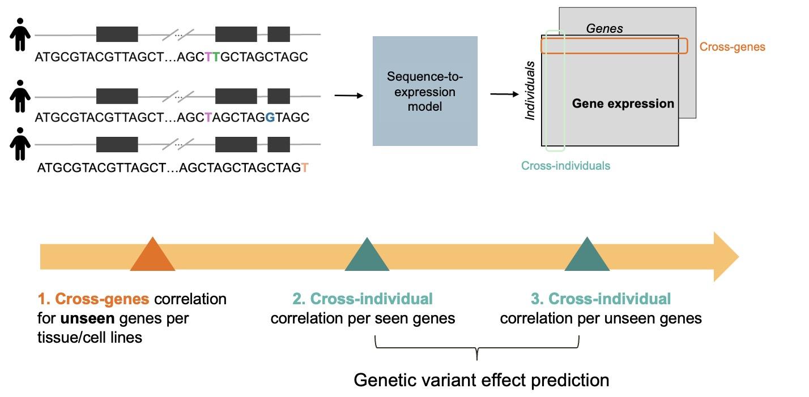

# Task1: Using genetic variants to predict personalised gene expression
## Task 1a: for gene level expression
### Object
Develop a sequence-based model to predict personalized gene expression by utilizing the DNA sequences. Your model should capture how DNA sequence variations influence gene expression levels.
### Evaluation Metrics
Model performance will be assessed through three key dimensions:

* **Across-genes**: Pearson correlation between true and predicted genome-wide expression profiles ​across held-out genes per test individual.

* **Across-individuals per seen gene**: Per-gene correlation between predictions and ground truth ​across held-out individuals for genes seen during training.

* **Across-individuals per unseen gene**: Per-gene correlation between predictions and ground truth ​across held-out individuals for unseen genes from training.



### Data
Root directory: `/mnt/project/task1_SNP2GEX` 

The dataset contains one subfoler and one CSV file:
* **fasta/** directory: 
    - Contains ​two FASTA files per individual (named <sampleID>_allele_[1/2].fasta)
    - Format per file:
        * Each record contains ​32kb flanking sequence around a gene's transcription start site (TSS)
        * ​Header syntax:
        ```bash
        >ENSG00000006282 chr:17;strand:+;start:48604419;end:48636419
        GGAGGGGGGCCTACTCTCTGACCCTGGCAAATCTTGGAGAAGGGGTTCATAGGTACAGAT
        TTCTGAGGGGGGTCCCTGGCTCCCACCAAAGGCACCCAGACAGCTCTCCATAGCTGCATC
        CCCTCCTGGTTCCTGGTCCCCTGCCACCCATCCCCACATCACCATGCCCTTCACTAGAG...
        ```
        Annotations include chromosome, strand, genomic coordinates.
* **partitions.csv**:
    - Contains gene expression levels and dataset splits:
    
        | Column name | Description |
        | --- | --- |
        | `sample` | individual identifier | 
        | `gene` | ENSG gene IDs |
        | `symbol` | gene symbols |
        | `chr` | chromosome |
        | `TSS` | transcriptional start site |
        | `strand` | DNA strand of the gene |
        | `rpkm`, `log_TPM`, `raw count`, `log_count` | gene expression levels |
        | `labels` | Group identifiers (`seen gene seen individuals`/`seen gene unseen individuals`/`unseen gene unseen individuals`) | 
        | `split` | Dataset partition (`train`/`test`) |


### Demo data load
We provide a dataloader for loading the raw sequences and the truth labels from the fasta file and the partition CSV file. The example code shown below:

```python
import Dataset
from torch.utils.data import DataLoader
import os
DATA_ROOT = "/mnt/project/task1_SNP2GEX/"

# set the `split` as "test" when you are evaluating.
# selected_samples = [], or selected_gene = [] means all individuals and all genes of the specific split category will be used. if you want to select subset of them, pass the list to the corresponding argument.
# you can also set target_name="raw count"/"log_count"/"rpkm" as you want

trainDataset = Dataset.SampleGeneExpressionDataset(split="train",csv_file=os.path.join(DATA_ROOT,"partitions.csv"),consensus_root=os.path.join(DATA_ROOT,"fasta"),selected_samples=[],selected_gene=[],target_name="log_TPM")

# set the batch size or the sampler as you want.
trainDataLoader = DataLoader(trainDataset, batch_size=1,shuffle=True)
# iterate the dataset, modify it as needed to utilize gLM embeddings!
for cur_seq_1, cur_seq_2, sample_target,sample_name,gene_name in trainDataLoader:
    print(f"cur_seq_1: {cur_seq_1}")
    print(f"cur_seq_2: {cur_seq_2}")

    # noted that sample_target will be NaN if split='test'
    print(f"sample_target:{sample_target}")
    print(f"sample_name:{sample_name}")
    print(f"gene_name: {gene_name}")
    break
```
Alternatively, you can also implement your own dataloader.

### Evaluation

You can upload your predictions and perform evaluation at our [ranking borad](http://10.64.155.14:5011) 

* **Usage**: make sure your uploaded CSV file at least has three columns: `sample`, `gene`, `log_TPM`, where `log_TPM` stores the predictions.

## Task 1b: for promoter-level activities
# Data
* The data of `Task 1b` is most the same with `Task 1a` (including CSV and fasta files), except two additional columns:

| Column | Description |
| --- | --- |
| `promoter activity` | promoter activity level, used as the y-labels |
| `promoter valid row` | the flag `1` indicating valid data row  in task 1b|

# Demo data load

* The dataloader of task1b is quite similar with task1a, the only difference is you need to set the `target_name` as `promoter activity`, example code shown as below:

```python
import Dataset
from torch.utils.data import DataLoader
import os
DATA_ROOT = "/mnt/project/task1_SNP2GEX"

# set the `split` as "test" when you are evaluating.
# selected_samples = [], or selected_gene = [] means all individuals and all genes of the specific split category will be used. if you want to select subset of them, pass the list to the corresponding argument.

trainDataset = Dataset.SampleGeneExpressionDataset(split="train",csv_file=os.path.join(DATA_ROOT,"partitions.csv"),consensus_root=os.path.join(DATA_ROOT,"fasta"),selected_samples=[],selected_gene=[],target_name="promoter activity")

# set the batch size or the sampler as you want.
trainDataLoader = DataLoader(trainDataset, batch_size=1,shuffle=True)
# iterate the dataset, modify it as needed to utilize gLM embeddings!
for cur_seq_1, cur_seq_2, sample_target,sample_name,gene_name in trainDataLoader:
    print(f"cur_seq_1: {len(cur_seq_1[0])}")
    print(f"cur_seq_2: {len(cur_seq_2[0])}")

    print(f"sample_target:{sample_target}")
    print(f"sample_name:{sample_name}")
    print(f"gene_name: {gene_name}")
    break
```
### Evaluation

You can upload your predictions and perform evaluation at our [ranking borad](http://10.64.155.14:5012) 

* **Usage**: make sure your uploaded CSV file at least has three columns: `sample`, `gene`, `promoter activity`, where `promoter activity` stores the predictions.


# Create Env on CPOS server

## Nucleotide Transformer env
1. Step 1: Load necessary modules
```bash
module load miniconda3/24.11.1_py312
module load git/2.41.0-GCCcore-12.3.0-nodocs
module load cuda/12.1.0
module load cuDNN/8.9.2.26-CUDA-12.1.1
```

2. Step 2: Clone the Cauduceus_repo

```bash
git clone https://github.com/instadeepai/nucleotide-transformer
```

3. Step3: 

```bash
conda create -n NT python=3.11
source activate NT
cd nucleotide-transformer
pip install .
```


